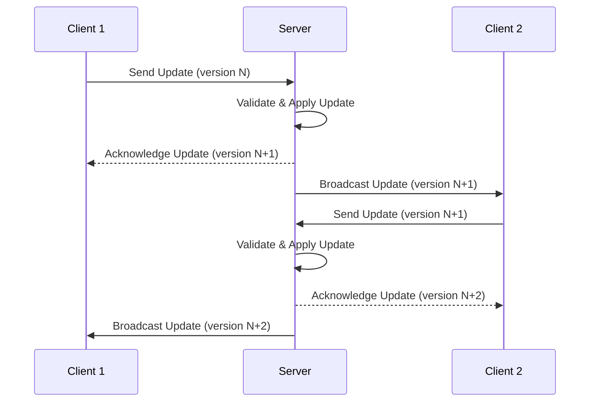
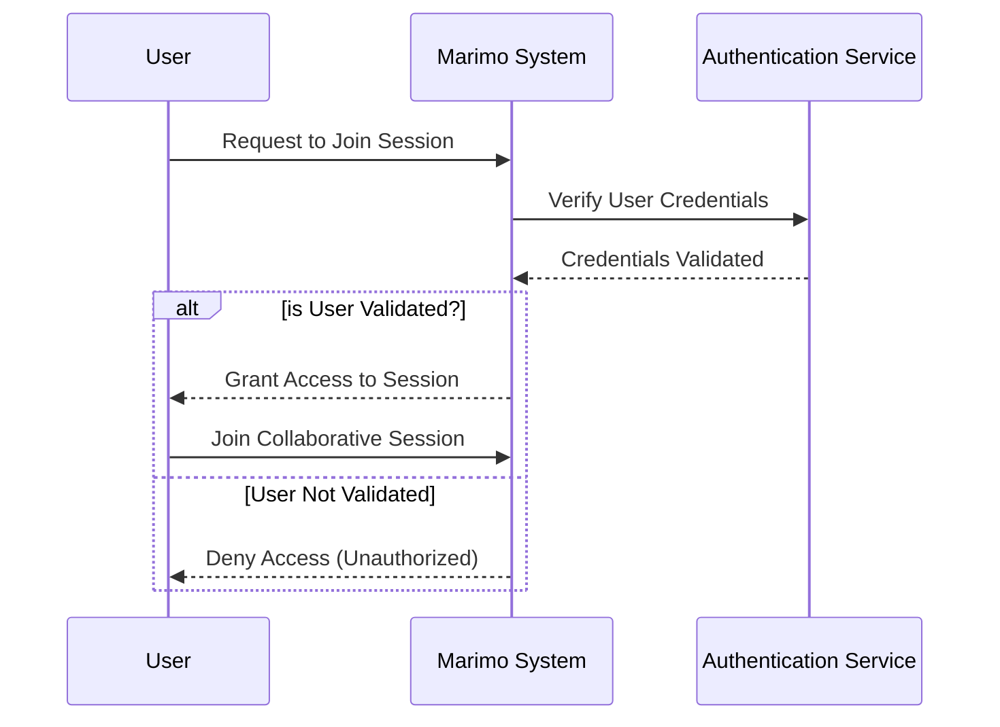

# Multiplayer

## Abstract
Introduce real-time collaborative editing in Marimo notebooks, leveraging the operational transformation capabilities of CodeMirror's `@codemirror/collab` package.
This enhancement facilitates simultaneous editing by multiple users within the same document, akin to collaborative features in modern development and document editing environments.

## Motivation
To enhance Marimo's usability in team settings by enabling live collaborative editing sessions.
This feature aligns with contemporary development environments' expectations, making Marimo a more competitive and attractive option for real-time, team-based code and document collaboration.
Moreover, the structure change allows third-party clients to interact with Marimo beyond a web browser (e.g., VSCode/ Vim), expanding appeal.

## Criteria
- Allow for multiple users to connect to a single session.
- Allow for real-time code/ app updates to all clients.
- Integration with existing and third-party clients (e.g., VSCode, Vim) through a documented API.
- Implementation does not compromise security or introduce significant overhead.

## Background
### Permission Model
Exploration of authentication mechanisms, possibly leveraging Jupyter's existing models or introducing password-based authentication for simplicity and security.

### Peer UI Case Studies
#### Google Docs
- Real-time cursor and selection visibility.
- User icons indicating active collaborators.

#### Overleaf.com
- Similar to Google Docs, it has additional features tailored for collaborative LaTeX editing.

#### Google Colab
- Recently removed real-time editing, highlighting the need for careful consideration of costs, support, and security in implementing such features.

## Design
### UI Proposal
- User icons in the upper left corner, styled according to the Marimo theme.
- Cursors with corresponding colors enhance the visibility of real-time collaboration.

### Technical Design
- Leveraging WebSockets for efficient, real-time communication of document changes and user actions.

### Auth flow

### Websocket Api
| Key                      | Description                                                                                   | Fields                       |
|--------------------------|-----------------------------------------------------------------------------------------------|------------------------------|
| `join`                   | For clients to join a specific collaborative session.                                    | `peer_id` `peer_colors` |
| `change`                 | For sending and receiving document changes and collaboration-specific messages.          | `id` `document_id` `changes`:[`from` `to` `message`] |
| `heartbeat`              | For sending periodic heartbeats to maintain the connection and check session health.     | |
| `cursor`                 | For broadcasting per cursor updates.                                                     | `cell` `line` `column` |
| `response`               | For direct response to a client or server action.                                        | `in-reply` `status` `error` |
| *`save`                  | Replacing webhook, trigger save on server document                                       | `id` `document_version` `document_id` `hash` |
| *`run`                   | Replacing webhook, trigger run on server document                                        | `id` `cell_version` `cell_id` `hash` |

>  Fields denoted with `*` are replacing existing webhooks.

## Proposed Rollout
**PR 1: Collaborative Infrastructure Setup**
- Basic integration of `@codemirror/collab`.
- WebSocket setup for live document updates.

**PR 2: Versioning and Conflict Management**
- Implement document versioning to manage edits accurately.
- Conflict resolution strategies to maintain document integrity.

**PR 3: UI for Collaboration**
- Develop UI components for collaboration (user presence, cursor positions).

**PR 4: Third-party Integration**
- API for third-party client integration.
- Examples with popular editors (VSCode, Vim).

**PR 5: Security Measures**
- Secure session initiation and management.
- Authentication and permission controls.

## Evaluation
- Ensure seamless real-time collaboration.
- Assess performance impact and security measures.
- User testing for collaboration features.

## Alternatives Considered
1. **Different Real-time Models**: Consideration of various real-time collaboration models, including those employed by Colab and Jupyter, with a focus on balancing functionality, performance, and security.

2. **Permission Models**: Discussion on the range of permission models, from open access to strict control, and the selection of a model that balances ease of use with security concerns.

## Future Work:
 - Version Control Integration: Plan for seamless integration with version control systems, enabling collaborative sessions to be linked with version histories, branch management, and commit strategies.
 - User Roles and Permissions for Marimo Cloud: Development of a robust permission model to support various user roles (e.g., viewer, editor, admin) in Marimo Cloud, including dynamic permission management during sessions.
