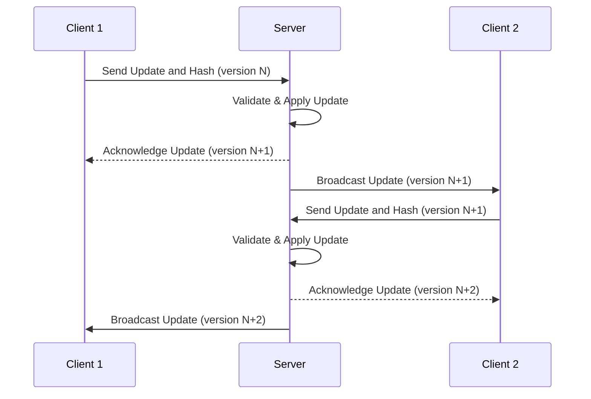
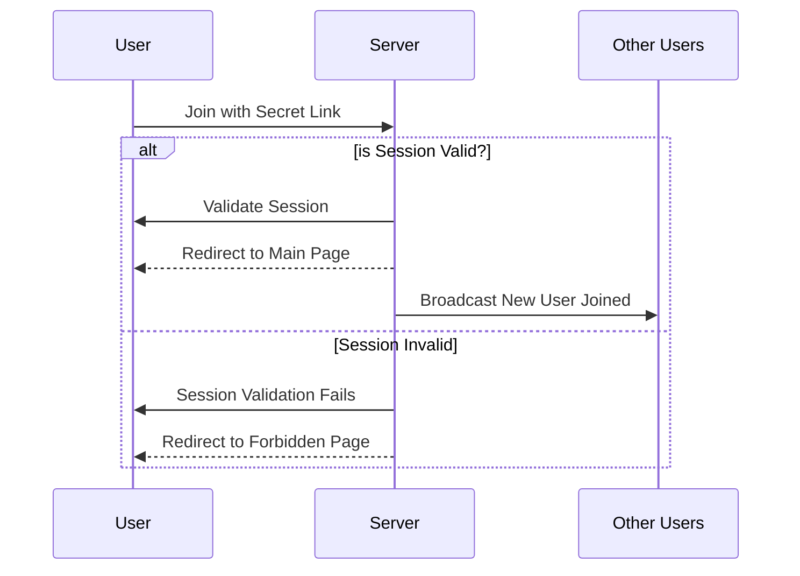
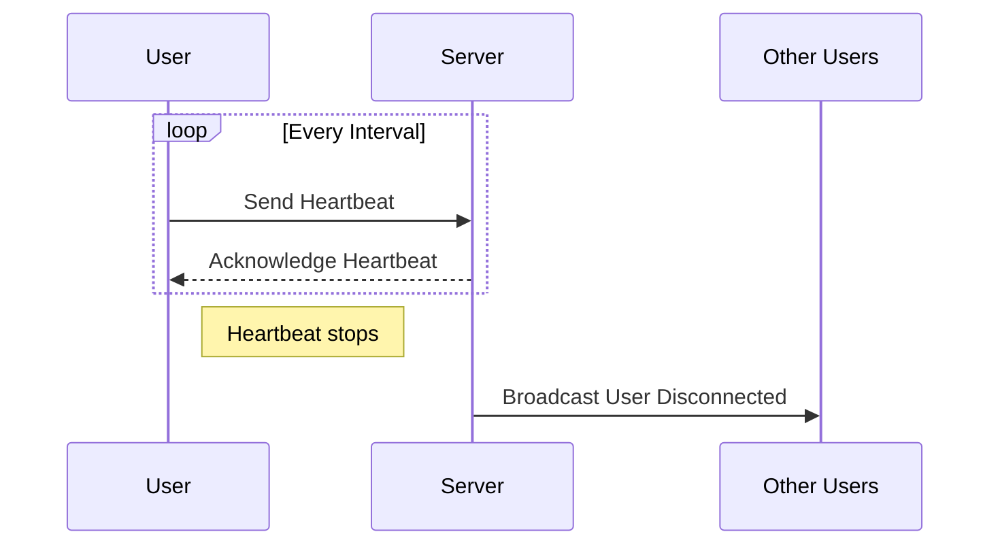

# Multiplayer

## Abstract
Introduce real-time collaborative editing in Marimo notebooks, leveraging the operational transformation capabilities of CodeMirror's `@codemirror/collab` package.
This enhancement facilitates simultaneous editing by multiple users within the same document, akin to collaborative features in modern development and document editing environments.

## Motivation
To enhance Marimo's usability in team settings by enabling live collaborative editing sessions.
This feature aligns with contemporary development environments' expectations (e.g. VSCode Live, or [JupyterHub](https://github.com/jupyterlab/jupyter-collaboration)), making Marimo a more competitive and attractive option for real-time, team-based code and document collaboration.
Moreover, the structure change allows third-party clients to interact with Marimo beyond a web browser (e.g., VSCode/ Vim), expanding appeal.

## Criteria
- Allow for multiple users to connect to a single session.
- Allow for real-time code/ app updates to all clients.
- Integration with existing and third-party clients (e.g., VSCode, Vim) through a documented API.
- Implementation does not compromise security or introduce significant overhead.

## Background

Because of the precedent that existing developer environments have created, a quick survey of them helps contextualize some of the design decisions of live file sharing for marimo.

### Permission Model Case Studies
#### Jupyter
Spawning a Jupyter Notebook provides a secret link in the terminal

Jupyter can also use password sharing to protect users by explicitly allowing certain notebooks to be trusted.

Reference: https://jupyter-notebook.readthedocs.io/en/5.7.1/security.html

#### VSCode
VSCode allows a secret link for sharing.

Reference: https://code.visualstudio.com/learn/collaboration/live-share

#### Google Colab
Notebooks are protected by a user and permission system.

Reference: https://research.google.com/colaboratory/faq.html#notebook-storage

### Peer UI Case Studies
#### Google Docs
- Real-time cursor and selection visibility.
- User icons indicating active collaborators.

#### Overleaf.com
- Uses `@codemirror/colab`
- User icon in upper left like Google Docs using user profile or first letter
- Cursor shows user on mouse over
- Cursor color does not match icon color
- Multiple tabs will display as multiple peers

#### Google Colab
Notes:
 - Colab removed their real-time editing without much announcement
 - Changes are visible on refresh
 - Bubble shows last person to run with runtime details
Conjectured Reasons for real-time removal:
 - Cost; something to keep in mind for marimo cloud
 - Support; this feature may have required unacceptable dev time to maintain
 - Security; real-time editing does raise the issue of security (imagine quickly pasting in a value before run)- this may have been an unacceptable liability for google.
I don’t know anyone on the colab team at google, and the internal tool also feels much more polished last time I was there

## Design
### UI Proposal
- User icons in the lower right corner, styled according to the Marimo theme.
- Cursors with corresponding colors enhance the visibility of real-time collaboration.
- Icons to indicate state (idle/ working)
- Click icon to jump to cursor position

### Technical Design
The server should hold the canonical state of the notebook content, this includes running and saving. User actions should primarily leverage WebSockets for efficient, real-time communication of document changes and user actions.

#### Document Change Flow
- Utilize hash of changed cell as validation of serverside model

#### Auth flow

#### Heart beat for User Presence

### Websocket Api
| Key                      | Description                                                                                   | Fields                       |
|--------------------------|-----------------------------------------------------------------------------------------------|------------------------------|
| `join`                   | For clients to join a specific collaborative session.                                    | `peer_id` `peer_colors` |
| `change`                 | For sending and receiving document changes and collaboration-specific messages.          | `id` `document_version` `cell_id` `changes`:[`from` `to` `message`] |
| `heartbeat`              | For sending periodic heartbeats to maintain the connection and check session health.     | |
| `cursor`                 | For broadcasting per cursor updates.                                                     | `cell` `line` `column` |
| `response`               | For direct response to a client or server action.                                        | `in-reply` `status` `error` |
| *`save`                  | Replacing webhook, trigger save on server document                                       | `id` `document_version` `document_id` `hash` `cell_names` |
| *`run`                   | Replacing webhook, trigger run on server document                                        | `id` `cell_version` `cell_id` `hash` |

>  Fields denoted with `*` are replacing existing webhooks.

## Proposed Rollout

The rollout plan involves the use of WebSocket for events and integrates the collaborative features provided by CodeMirror's collaboration module ([CodeMirror Collab Reference](https://codemirror.net/docs/ref/#collab)).

### PR 0: Run Queue Bug Fix
- **Bug**
  - The kernel currently queues runs. This isn't an issue as a single user, but with multiple users this could lead to over running cells for long running cells
  - Resolve new run requests against current running cells.
    - If cell is dependent on a running cell, consider as noop
    - If cell is not a dependent cell, handle as normal (ideally, should be run concurrently, not sure if that is currently the case)

### PR 1: Introduce Collaboration Foundation
- **Features**:
  - Implement collaborative editing features using CodeMirror's `collab`.
  - `change` (send) websocket action to send document changes to the server where the current state and version are maintained.
    - `id`: random id for response reference (Overleaf uses random base per user and increments per change)
    - `cell_id`: id of the cell running
    - `changes`: changes from `@collab`
  - `run`: Same as the current endpoints, but over WS (optional)
    - `id`: random id for response reference
    - `cell_id`: cell to run
    - `hash`: hash of cell and dependents
  - `save`: Same as the current endpoints, but over WS (recommended)
    - `id`: random id for response reference
    - `hash`: hash of the document
    - `cell_names`: for renaming cells
- **Proposed Tests**:
  - Test for a mismatching hash scenario to ensure document version integrity.
  - Validate the handling of a correct hash to confirm successful synchronization.
  - Assess the system's response to an old document version to ensure backward compatibility.
  - Evaluate behavior with an old document version after a newer save to test version conflict resolution.
  - Examine the handling of unknown document versions to ensure robust error management.

### PR 2: Experimental Shared Session
- **Features**:
  - Introduce `--experimental-shared-session` for testing shared session capabilities without affecting the rolling release.
  - Remove kernel browser block for multiple connecting users.
    - Accept multiple websocket sessions
  - Generate and handle secret links for session access (`127.0.0.1/join/<random>`).
  - Authenticate users based on session hash validation.

### PR 4: Change Communication
  - `change` (send) implementation for updating document

### PR 5: Enhance WebSocket Communication
- **Features**:
  - Expand WebSocket API to include heartbeat signals to maintain connection health.
  - Implement peer status UI.
  - Implement peer connect and disconnect notifications.
  - Integrate cursor tracking for visibility in collaborative interaction.
- **Proposed Tests**:
  - Test peer connection to ensure users can successfully join a session.
  - Assess peer disconnection handling to manage users leaving a session.

### PR 6: Kiosk/App Editor View
- **Features**:
  - Develop a kiosk or app-only editor view accessible via `--kiosk` flag.
  - Add kiosk auth endpoint (`127.0.0.1/kiosk/<random>`) for simplified, view-only / grid access.

### PR 7: Integration with VSCode
- **Features**:
  - Adapt the existing VSCode plugin to utilize the WebSocket communication for collaborative editing.
  - Ensure seamless interaction between Marimo and VSCode through WebSocket.

## Evaluation
 > Allow for multiple users connected to a single session

`@collab` allows for multiple users to use a single kernel

 > Allow for real-time code/ app updates to all clients

`@collab` operates on a per change basis, enabling realtime updates

 > Allow for documented extensibility to multiple client types (VSCode/ vim)

As state updates occur through websockets, additionally, existing `@collab` based plugins can be adapted (example [AirLatex](https://github.com/dmadisetti/AirLatex.vim).

 > Does not introduce security problems

Having multiple users allows for potential security issues. However:
 - Kernels are protected by passphrase
 - All requests are associated with an authenticated user session
 - Heartbeat allows user connection information

## Alternatives Considered
1. **Different Real-time Model**
   - `@collab` is well-validated. Moreover, it can refer to prior work for implementation strategies.

2. **Lower Levels of Real-time Updates:**
   a. **Handle Multiple Clients Based on Save State**
      - Similar to Colab/vanilla Jupyter, which allows multiple clients, but a refresh only updates to a saved state. Out of the box, there is no dynamic code changing across clients. This is not reasonable due to the reactive nature of Marimo, where notebook contents are closely tied to state.

   b. **Handle Multiple Clients Based on Just Run State**
      - Code blocks are updated for all clients when they are run, which can potentially confuse the user experience. This approach can lead to block conflicts.

3. **Permission Model**
   a. **App-only Permission**
      - Provides a link for 3rd party client views or quickly shares a live application link. This introduces a surface area for poor development practices, as there would have to be a disclaimer that edit mode app-only should not be run in production, and to use `marimo run` to prevent unintended privilege escalation. Moreover, app-only doesn’t satisfy 3rd party client requirements if the user wants to make grid changes, hence kiosk mode seems the best compromise.

   b. **Read-only Permission**
      - Since the share static notebook functionality exists, this adds a layer of complexity for only marginal benefit.

   c. **Admin Permission / Manual Permission Granting**
      - On a new WebSocket request, admin sessions receive a prompt to allow a new session with the respective permission. This requires manual intervention and could lead to unintended sharing of sessions. It introduces unnecessary complexity. The suggestion for Marimo-cloud is to build authentication on top of the existing model as opposed to incorporating users and user permissions directly into Marimo.

## Future Work:
 - Version Control Integration: Plan for seamless integration with version control systems, enabling collaborative sessions to be linked with version histories, branch management, and commit strategies.
 - User Roles and Permissions for Marimo Cloud: Development of a robust permission model to support various user roles (e.g., viewer, editor, admin) in Marimo Cloud, including dynamic permission management during sessions.
